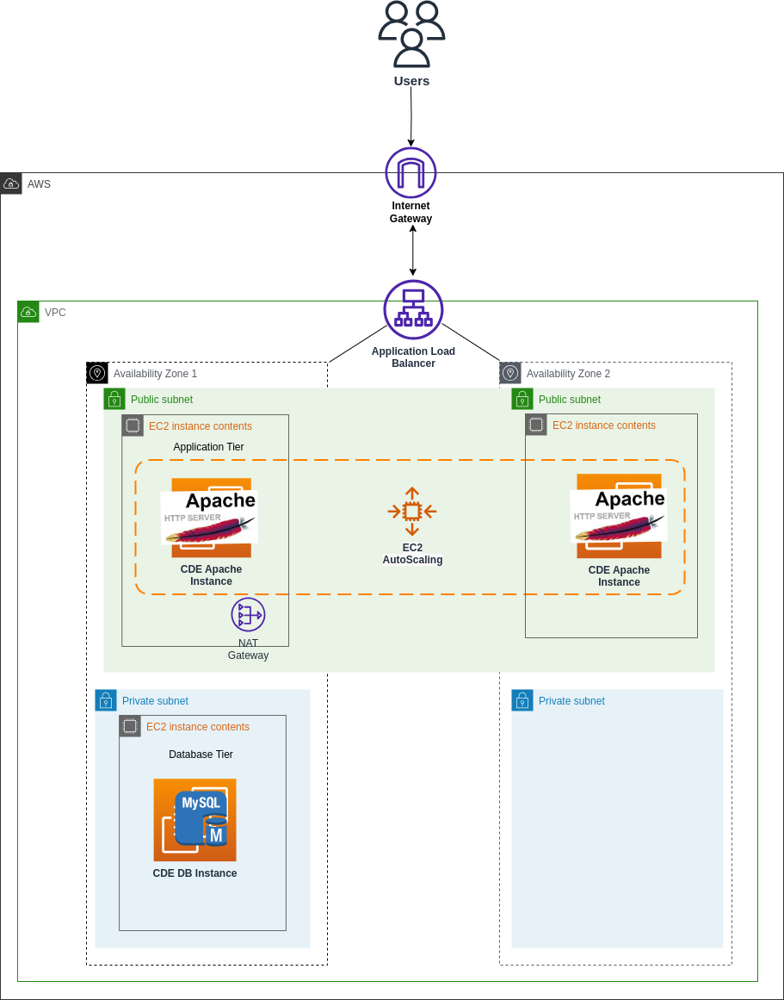
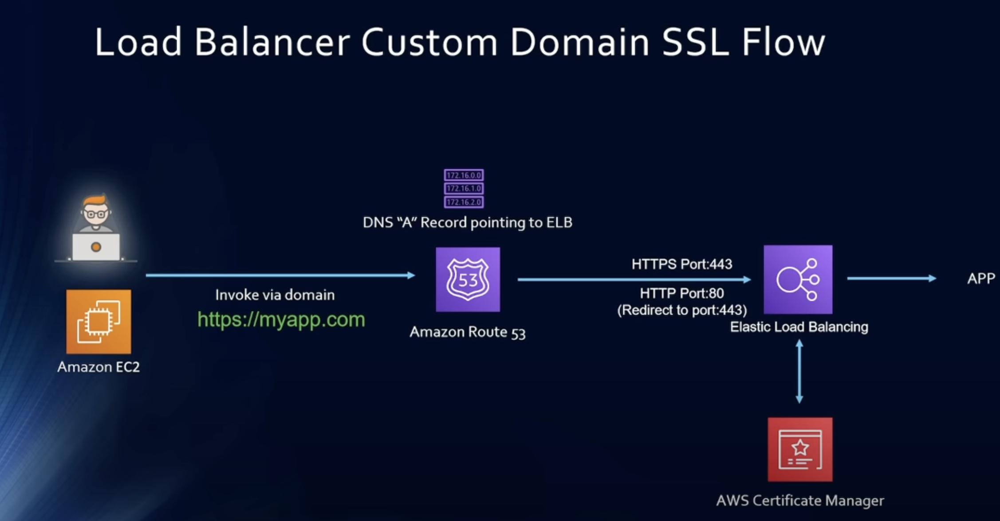

# Terraform README

## Introduction

This README provides guidance on using Terraform to manage aws infrastructure for the project. The terraform deploys the architecture given in the diagram below which contains EC2 running an Apache server with Auto Scaling feature. Also, a MySQL DB installed inside a another EC2 in private subnet. Load balancer is used to redirect the traffic to the auto-scaling instances and hitting ALB DNS will display Apache web server page.




## Prerequisites

Before getting started, ensure that you have the following prerequisites installed on your system:

- Terraform v0.12.6 (https://learn.hashicorp.com/tutorials/terraform/install-cli) CLI
- AWS CLI v2.53 (if deploying resources on AWS)
- Access to your cloud provider account and necessary permissions
- Text editor (e.g., Visual Studio Code, Sublime Text) for editing Terraform configuration files

These types of resources are supported:

- VPC
   - Public Subnet
   - Private Subnet
   - Availability Zones
   - Internet Gateway
   - NAT Gateway

- Elastic Compute Cloud (EC2)
   - Launch configuration
   - Autoscaling Group

- Security Groups
   - SSH
   - HTTP
   - HTTPS
   - MYSQL

- Application Load Balancer


## SSM Parameter 

Create an SSM Parameter in AWS Systems Manager with a name as given below:

  ```bash
/database/db_password
```
Provide the value of the DB Password parameter and make sure it is greater than 8 characters. 

## Getting Started

Follow these steps to get started with Terraform:

## Terraform Parameter Configuration

For any parameter you want to change for the terraform resources parameterized using variables, navigate to **dev.auto.tfvars**, do the necessary change and spin up the terraform.

## Terraform Initialization

Open the terraform main folder in the VSCode and in the root directory [ which
contains other directories like modules, template etc. ] type the command given below
for terraform initialization:

  ```bash
  cd aws-terraform-demo
terraform init
```
## Terraform Apply

Once terraform is initialized, run the command below to see which resources would get
deployed if terraform script runs successfully:
terraform plan
To deploy infrastructure, run the command below in in root folder

  ```bash
terraform apply
```

## Hitting ALB DNS 

Once the deployment is completed, hit the DNS of ALB shown in the output and you can view the Apache Web server page on the browser.


## For SSL



To add an SSL certificate to an Application Load Balancer (ALB) in AWS using Terraform, we can use the aws_acm_certificate resource to request and validate the certificate, and the aws_lb_listener_certificate resource to associate the certificate with the ALB listener.

Here are the things which you need to do -
Need to have fqdn -  domain name created
Request and validate an SSL certificate from AWS Certificate Manager (ACM)
Associate the SSL certificate with the ALB listener

The aws_acm_certificate resource requests an SSL certificate for the specified domain name and validation method. 
The certificate is validated using the DNS validation method, which means that you will need to create DNS records to prove that you own the domain. The aws_lb_listener_certificate resource associates the SSL certificate with the ALB listener, which means that the ALB will use the certificate to terminate SSL connections.

Note that the SSL certificate will only be available for use after it has been successfully validated. This can take some time, depending on the validation method used. You can use the aws_acm_certificate_validation resource to check the validation status of the certificate.

## Terraform Destroy

As part of cleanup destroy the aws resources, type the command below:

  ```bash
terraform destroy
```